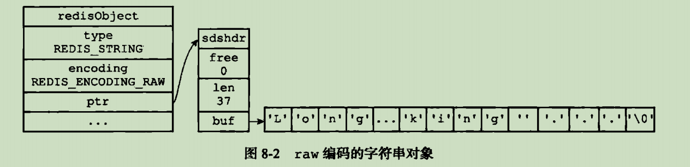

# 动态字符串SDS

概述

* Redis 键值对,键和值是一个SDS
* SDS被用作缓冲区(buffer)  AOF缓冲区,以及客户端状态中输入缓冲区

结构
    

优点

概述

* 常数时间获得字符串长度
* 杜绝了缓存区溢出问题
* 减少修改字符创时带来内存重分配次数
  1. 空间预分配 (提前多分配空间)
  2. 惰性空间释放
* 二进制安全,存储二进制数据
* 兼容部分C字符串函数

其他
[键设计](https://mp.weixin.qq.com/s?spm=a2c6h.12873639.0.0.753b1feeKkJiDx&__biz=Mzg2NTEyNzE0OA==&mid=2247483663&idx=1&sn=7c4ad441eaec6f0ff38d1c6a097b1fa4&chksm=ce5f9e8cf928179a2c74227da95bec575bdebc682e8630b5b1bb2071c0a1b4be6f98d67c37ca&scene=21#wechat_redirect)

