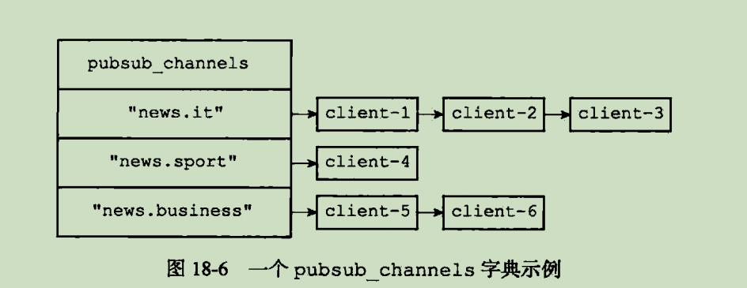
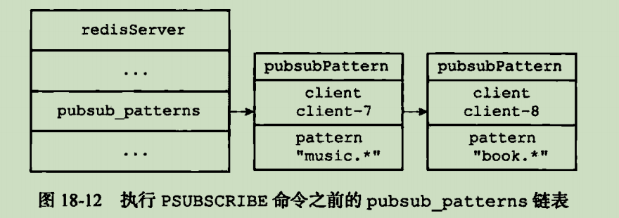

# 发布与订阅

概述: 通过执行subscribe命令,客户端订阅一个或多个频道:每当有其他客户端向订阅者发送消息时,频道所有订阅值都会收到这个消息

分两种:频道订阅和模式订阅

## 频道订阅与退订

pubsub_channels字典,key记录某个被订阅的频道,value是所有订阅该频道的客户端

subscribe "news.sport"\
unsubscribe "news.sport"

## 模式订阅与退订

psubcribe "news.*"\
punsubscribe "news.*"

## 发送消息

publish \<channel> \<message>

频道订阅是查找字典中所有订阅客户端
模式订阅是遍历整个链表,把消息发送出去

## 查看订阅消息

pubsub channel [pattern] \
pubsub numsub [ channel-1 channel-2]\
pubsub numpat 
