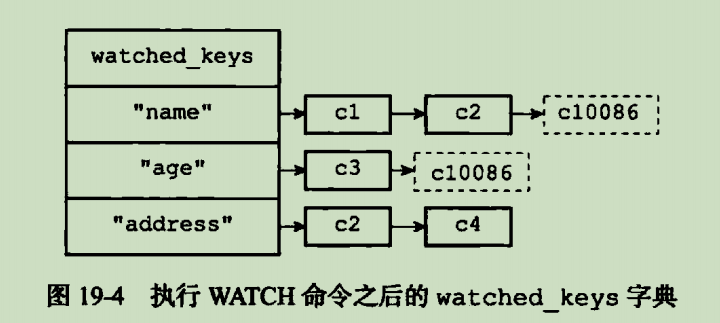
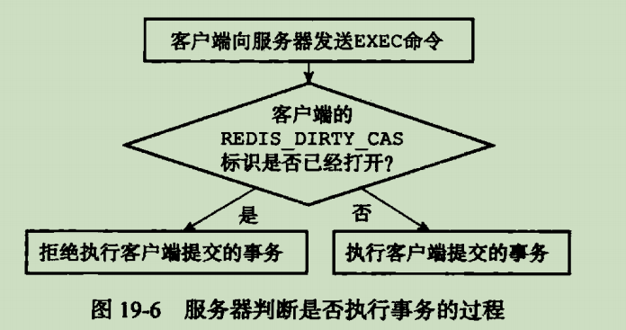

# 事务

<!-- TOC -->

- [事务](#事务)
    - [事务实现](#事务实现)
        - [事务开始](#事务开始)
        - [命令入队](#命令入队)
        - [事务执行](#事务执行)
    - [watch乐观锁实现](#watch乐观锁实现)
    - [ACID性质](#acid性质)
        - [原子性](#原子性)
        - [一致性](#一致性)
        - [隔离性](#隔离性)
        - [持久性](#持久性)

<!-- /TOC -->

主要指令 MULTI EXEC WATCH DISCARD

Redis提供一种将多个命令打包,然后一次性,有序地执行机制

## 事务实现

### 事务开始

MULTI标志事务开始

### 命令入队

### 事务执行

EXEC命令开始,遍历客户端事务队列,执行队列中保存的所有命令

## watch乐观锁实现

监视若干数量的数据库键,在exec执行时,检查被监视的键是否至少有一个已被修改过,如果是,拒绝执行事务,并向客户端返回事务执行失败的空回复

watched_keys字典,字典键是某个被watch命令监视的数据库键,字典值是一个记录所有监视客户端的客户端

事务安全处理

一次完成watch事务执行过程\
(1) 客户端c10086 ,执行 watch "name"
(2) 开始事务 Multi
(3) set值后redis_dirty_cas被打开直接报错

使用unwatch剔除观察变量

## ACID性质

### 原子性

事务中所有命令,要么全部执行的,要不都不执行,就有原子性

- 入队失败,所有命令都不会执行
- 如果执行过程中出错,事务后续命令仍会继续执行下去,不会回滚

解释:执行中错误都是不认真编写命令所致,例如跨类型操作

### 一致性

一致性指,数据库执行前后数据仍然逻辑一致,redis可以保持一致性

- 入队失败
- 执行错误
- 服务器停机

### 隔离性

redis文件事件处理器是单线程的,执行事务器件不会被打断,redis事务总是串行化运行,天然隔离

### 持久性

AOF always模式AOF持久化,并且服务器appendfsync-on-rewirte要打开