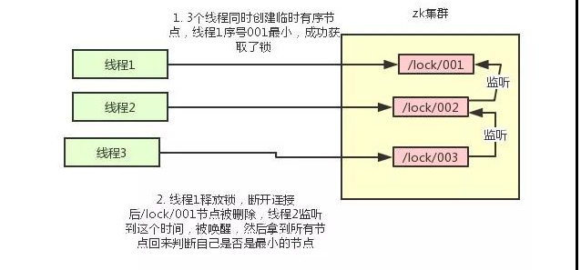

# 分布式锁

## 三种实现

1. 数据库乐观锁
2. 基于redis的分布式锁
3. 基于zookeeper的分布式锁

分布式锁: 首先获取锁,然后执行操作,最后释放锁

WATCH命令实现 被称之为乐观锁
SETEX 命令具有加锁功能,但是功能不完整

setnx expire del set三个命令实现,执行完成之后del+lur操作就可以

## 标准代码

1. 加锁

```java
public class RedisTool {
 
    private static final String LOCK_SUCCESS = "OK";
    private static final String SET_IF_NOT_EXIST = "NX";
    private static final String SET_WITH_EXPIRE_TIME = "PX";
 
    /**
     * 尝试获取分布式锁
     * @param jedis Redis客户端
     * @param lockKey 锁
     * @param requestId 请求标识
     * @param expireTime 超期时间
     * @return 是否获取成功
     */
    public static boolean tryGetDistributedLock(Jedis jedis, String lockKey, String requestId, int expireTime) {
        String result = jedis.set(lockKey, requestId, SET_IF_NOT_EXIST, SET_WITH_EXPIRE_TIME, expireTime);
        if (LOCK_SUCCESS.equals(result)) {
            return true;
        }
        return false;
    }
}
```

2. 解锁

使用`redis 127.0.0.1:6379> EVAL script numkeys key [key ...] arg [arg ...]`

```java

public class RedisTool {
 
    private static final Long RELEASE_SUCCESS = 1L;
 
    /**
     * 释放分布式锁
     * @param jedis Redis客户端
     * @param lockKey 锁
     * @param requestId 请求标识
     * @return 是否释放成功
     */
    public static boolean releaseDistributedLock(Jedis jedis, String lockKey, String requestId) {
 
        String script = "if redis.call('get', KEYS[1]) == ARGV[1] then return redis.call('del', KEYS[1]) else return 0 end";
        Object result = jedis.eval(script, Collections.singletonList(lockKey), Collections.singletonList(requestId));
 
        if (RELEASE_SUCCESS.equals(result)) {
            return true;
        }
        return false;
 
    }
 
}
```
Redis 有 3 种部署方式：

单机模式
Master-Slave+Sentinel 选举模式
Redis Cluster 模式

使用 Redis 做分布式锁的缺点在于：如果采用单机部署模式，会存在单点问题，只要 Redis 故障了。加锁就不行了。

采用 Master-Slave 模式，加锁的时候只对一个节点加锁，即便通过 Sentinel 做了高可用，但是如果 Master 节点故障了，发生主从切换，此时就会有可能出现锁丢失的问题。

基于以上的考虑，Redis 的作者也考虑到这个问题，他提出了一个 RedLock 的算法。

这个算法的意思大概是这样的：假设 Redis 的部署模式是 Redis Cluster，总共有 5 个 Master 节点。

通过以下步骤获取一把锁：

获取当前时间戳，单位是毫秒。
轮流尝试在每个 Master 节点上创建锁，过期时间设置较短，一般就几十毫秒。
尝试在大多数节点上建立一个锁，比如 5 个节点就要求是 3 个节点（n / 2 +1）。
客户端计算建立好锁的时间，如果建立锁的时间小于超时时间，就算建立成功了。
要是锁建立失败了，那么就依次删除这个锁。
只要别人建立了一把分布式锁，你就得不断轮询去尝试获取锁。
但是这样的这种算法还是颇具争议的，可能还会存在不少的问题，无法保证加锁的过程一定正确。

[redlock](https://zhuanlan.zhihu.com/p/59256821)
Redisson

SET anyLock unique_value NX PX 30000 

这里设置的超时时间是 30s，假如我超过 30s 都还没有完成业务逻辑的情况下，Key 会过期，其他线程有可能会获取到锁。

这样一来的话，第一个线程还没执行完业务逻辑，第二个线程进来了也会出现线程安全问题。

```java
Config config = new Config(); 
config.useClusterServers() 
.addNodeAddress("redis://192.168.31.101:7001") 
.addNodeAddress("redis://192.168.31.101:7002") 
.addNodeAddress("redis://192.168.31.101:7003") 
.addNodeAddress("redis://192.168.31.102:7001") 
.addNodeAddress("redis://192.168.31.102:7002") 
.addNodeAddress("redis://192.168.31.102:7003"); 
 
RedissonClient redisson = Redisson.create(config); 
 
 
RLock lock = redisson.getLock("anyLock"); 
lock.lock(); 
lock.unlock(); 
```

Redisson 所有指令都通过 Lua 脚本执行，Redis 支持 Lua 脚本原子性执行。
Redisson 设置一个 Key 的默认过期时间为 30s，如果某个客户端持有一个锁超过了 30s 怎么办？
Redisson 中有一个 Watchdog 的概念，翻译过来就是看门狗，它会在你获取锁之后，每隔 10s 帮你把 Key 的超时时间设为 30s。
Redisson 的“看门狗”逻辑保证了没有死锁发生。(如果机器宕机了，看门狗也就没了。此时就不会延长 Key 的过期时间，到了 30s 之后就会自动过期了，其他线程可以获取到锁)

Redisson 还提供了对 Redlock 算法的支持，它的用法也很简单：

```java
RedissonClient redisson = Redisson.create(config); 
RLock lock1 = redisson.getFairLock("lock1"); 
RLock lock2 = redisson.getFairLock("lock2"); 
RLock lock3 = redisson.getFairLock("lock3"); 
RedissonRedLock multiLock = new RedissonRedLock(lock1, lock2, lock3); 
multiLock.lock(); 
multiLock.unlock(); 
```

redLock实现
(
假设有N个Redis master 节点相互独立,不存在主从同步以及其他集群的协调机制,假设N为5

客户端操作

1. 获取当前unix时间,单位为毫秒
2. 以此尝试从5个实例,使用相同key和具有唯一唯一性value获取锁,客户端在规定时间加锁,加锁不成功,就去下一个实例加锁
3. 客户端使用当前时间减去开始获取锁时间（步骤1记录的时间）就得到获取锁使用的时间。当且仅当从大多数（N/2+1，这里是3个节点）的Redis节点都取到锁，并且使用的时间小于锁失效时间时，锁才算获取成功。
4. 如果取到了锁，key的真正有效时间等于有效时间减去获取锁所使用的时间（步骤3计算的结果）。
5. 如果因为某些原因，获取锁失败（没有在至少N/2+1个Redis实例取到锁或者取锁时间已经超过了有效时间），客户端应该在所有的Redis实例上进行解锁


zookeeper实现分布式锁



Curator 客户端

```java
InterProcessMutex interProcessMutex = new InterProcessMutex(client,"/anyLock"); 
interProcessMutex.acquire(); 
interProcessMutex.release(); 
```

[zk锁](https://zhuanlan.zhihu.com/p/73807097)


两种锁对比

对于 Redis 的分布式锁而言，它有以下缺点：

它获取锁的方式简单粗暴，获取不到锁直接不断尝试获取锁，比较消耗性能。
另外来说的话，Redis 的设计定位决定了它的数据并不是强一致性的，在某些极端情况下，可能会出现问题。锁的模型不够健壮。
即便使用 Redlock 算法来实现，在某些复杂场景下，也无法保证其实现 100% 没有问题，关于 Redlock 的讨论可以看 How to do distributed locking。
Redis 分布式锁，其实需要自己不断去尝试获取锁，比较消耗性能。
但是另一方面使用 Redis 实现分布式锁在很多企业中非常常见，而且大部分情况下都不会遇到所谓的“极端复杂场景”。

所以使用 Redis 作为分布式锁也不失为一种好的方案，最重要的一点是 Redis 的性能很高，可以支撑高并发的获取、释放锁操作。

对于 ZK 分布式锁而言:

ZK 天生设计定位就是分布式协调，强一致性。锁的模型健壮、简单易用、适合做分布式锁。
如果获取不到锁，只需要添加一个监听器就可以了，不用一直轮询，性能消耗较小。
但是 ZK 也有其缺点：如果有较多的客户端频繁的申请加锁、释放锁，对于 ZK 集群的压力会比较大。

小结：综上所述，Redis 和 ZK 都有其优缺点。我们在做技术选型的时候可以根据这些问题作为参考因素。
