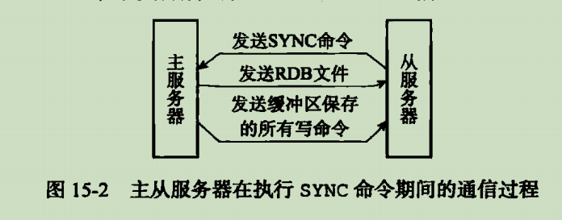
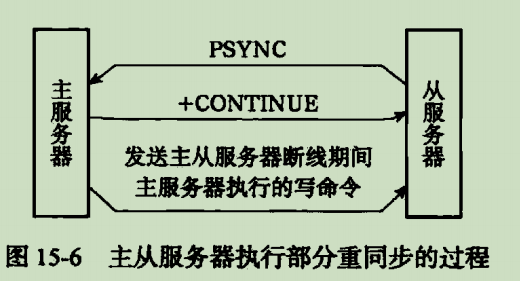
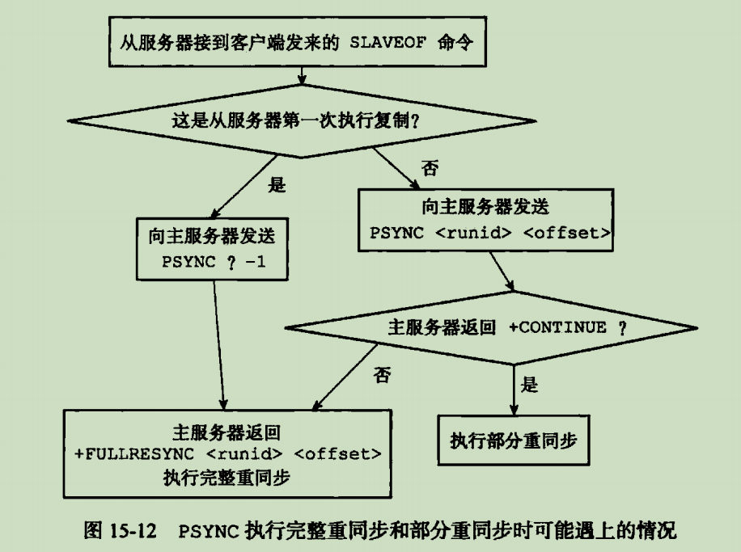

# 主从复制

## 旧版复制功能

同步

命令传播
    主服务器的处理完命令之后,发送相应的命令给从服务器

缺陷

初次复制没问题,断线重复制需要全量,效率太低 sync不建议使用

## 新版复制功能实现

psync 命令可以实现完整重同步和部分重同步

部分重同步实现原理\
三要素:复制偏移量,复制积压缓冲区,服务器运行ID

如果复制积压缓冲区无法容纳,仍会走全量复制那一套

复制的实现

1. 设置主服务器的的地址和端口
2. 建立套接字链接
3. 发送PING命令
4. 身份验证
5. 发送端口信息
6. 同步
7. 命令传播

## 心跳检测

- 检测主从服务器网络链接状态
- 辅助实现min-slaves选项
- 检测命令丢失

