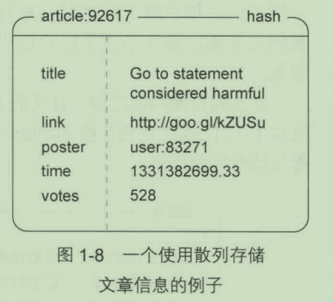
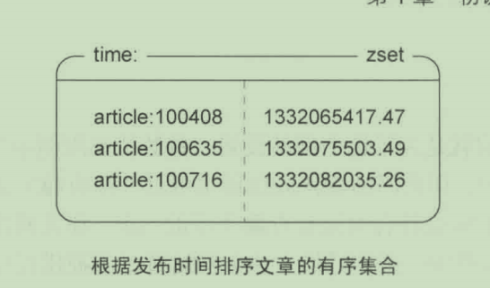
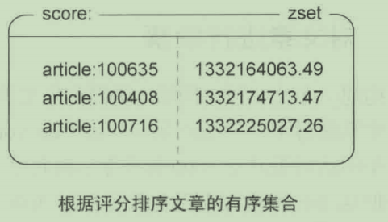
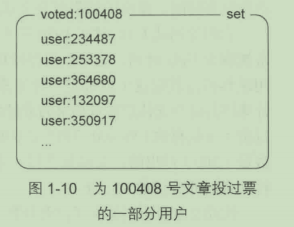
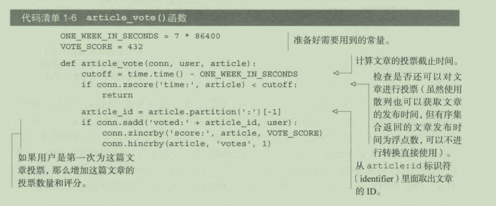
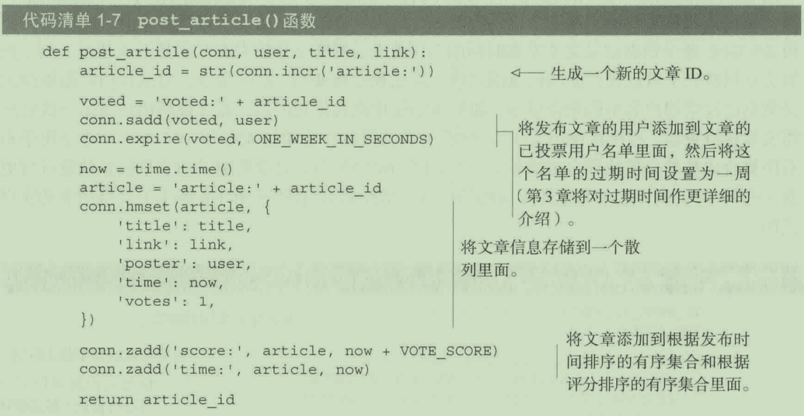
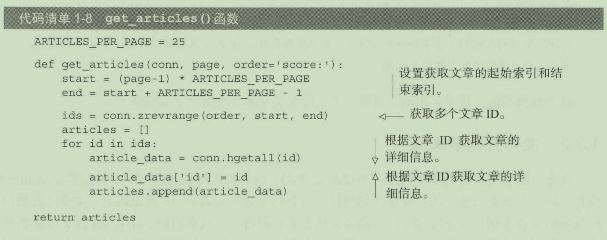
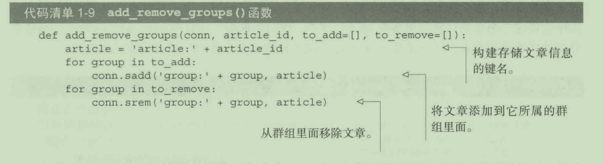
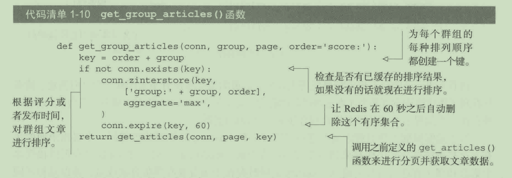

# 投票

相关指令:

- score
- sadd
- zincrby
- hincrby
- expire
- zadd
- zrevrange
- hgetall
- srem
- zinterstore

文章基本信息:hash

发布时间排序的有序集合 zset

评分排序的有序集合 zset

文章投票用户集合 set

投票流程

发布获取文章

获取文章

文章分组

获取分组程序

投反对票可以使用SMOVE