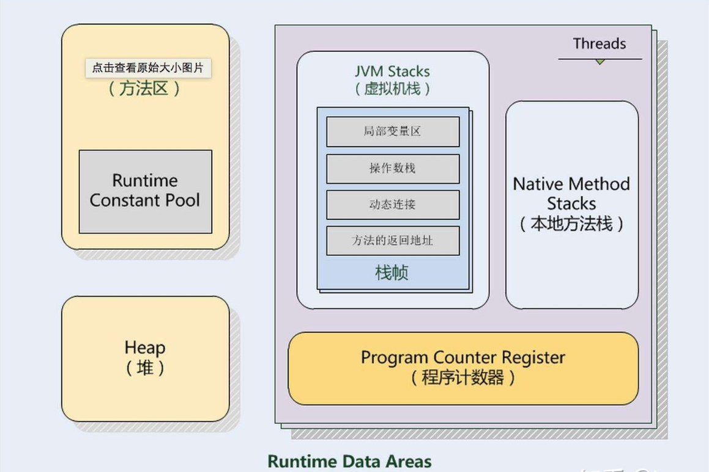

# [元空间](https://my.oschina.net/u/3179064/blog/3145443)

java7 内存结构

方法区 堆 虚拟机栈 本地方法栈 程序计数器

所有线程共享的只有堆和方法区

java8 内存结构

程序计数器 本地方法栈 堆, 虚拟机栈 本地内存(元数据区和直接内存)

java7 以及以前版本方法区位于永久代,永久代和堆相互隔离,但物理地址连续,垃圾回收和老年代一块

java7 符号引用 字符串常量池和类静态变量转移到java堆中

只有hotspot有永久代溢出之说

java8 用元空间替代了原来方法区 方法区存在于元空间,元空间属于本地内存

当Java Heap空间不足时会触发GC，但Native memory空间不够却不会触发GC。默认情况下元空间是可以无限使用本地内存的，但为了不让它如此膨胀，JVM同样提供了参数来限制它使用的使用。

java8变化
移除了永久代（PermGen），替换为元空间（Metaspace）

永久代中的class metadata（类元信息）转移到了native memory（本地内存，而不是虚拟机）

永久代中的interned Strings（字符串常量池） 和 class static variables（类静态变量）转移到了Java heap

永久代参数（PermSize MaxPermSize）-> 元空间参数（MetaspaceSize MaxMetaspaceSize）

为什么?

字符串存在永久代中，容易出现性能问题和内存溢出。

类及方法的信息等比较难确定其大小，因此对于永久代的大小指定比较困 难，太小容易出现永久代溢出，太大则容易导致老年代溢出。

永久代会为 GC 带来不必要的复杂度，并且回收效率偏低。

Oracle 可能会将HotSpot 与 JRockit 合二为一，JRockit没有所谓的永久代。