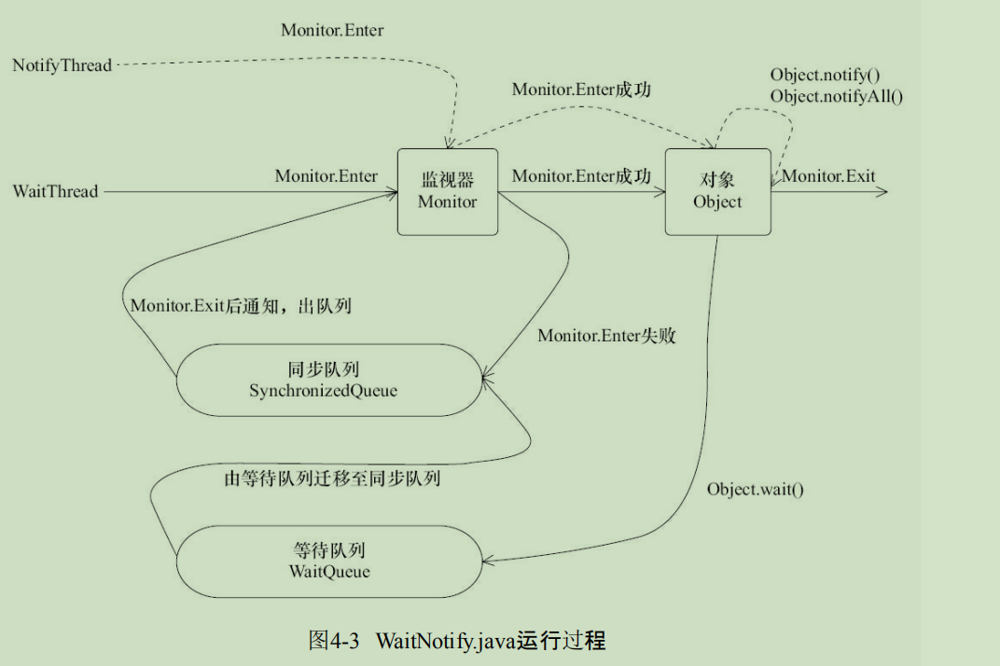

# 等待/通知机制

## 细节

- 使用wait(),notify(),notifyAll()对象需要提前获得锁
- 调用wait()后,线程从RUNNING变成WAITING,线程放置在对象等待队列
- notify或notifyALL方法调用后,等待线程依旧不会从wait()返回,需要调用notify()或notifyAll() 线程释放锁之后,等待线程才有机会从wait()返回
- notify()方法将同步队列中一个等待线程从等待队列中移到同步队列中,而notifyAll方法将等待队列中所有线程移动到同步队列中,移动线程从WAITING 变成Blocked状态.



## 经典编程方式

- 等待方逻辑

```java
synchronized(对象){
    while(条件不满足){
        对象.await();
    }
    对应的处理逻辑;
}
```

- 通知方处理逻辑

```java
synchronized(对象){
    改变条件;
    对象.notifyAll();
}
```
