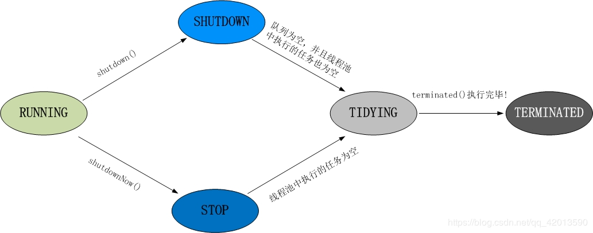

# 线程状态切换

## 状态切换关系


### 说明

- BLOCKED状态
    1. 当前线程在等待一个monitor lock，比如等待执行synchronized代码块或者使用synchronized标记的方法。
    2. 在synchronized中调用Object的wait方法 

     ```java
         synchronized(this){
          while (flag){
          obj.wait();
          }
          // some other code
          }
     ```

- WAITING状态
    1. 调用object对象的wait方法,没有指定超时时间
    2. 调用Thread Join没有指定超时时间
    3. 调用LockSupport对象park方法
- TIMED_WAITING状态
    1. 调用Thread.sleep方法
    2. 调用Object对象wait方法,指定了超时时间
    3. 调用Thread对象join放大,指定了超时时间
    4. 调用LockSupport对象的parkNanos方法
    5. 调用LockSupport对象park_util方法

## 线程池状态切换



- Running状态
    在RUNNING状态下，线程池可以接收新的任务和执行已添加的任务。

- SHUTDOWN状态
  线程池处在SHUTDOWN状态时，不接收新任务，但能处理已添加的任务。

- STOP状态
  线程池处在STOP状态时，不接收新任务，不处理已添加的任务，并且会中断正在执行的任务。

- TIDYING状态
  当所有的任务已终止，记录的”任务数量”为0，线程池会变为TIDYING状态。当线程池变为TIDYING状态时，会执行钩子函数terminated()。

- TERMINATED
  钩子函数terminated()被执行完成之后，线程池彻底终止，就变成TERMINATED状态。 